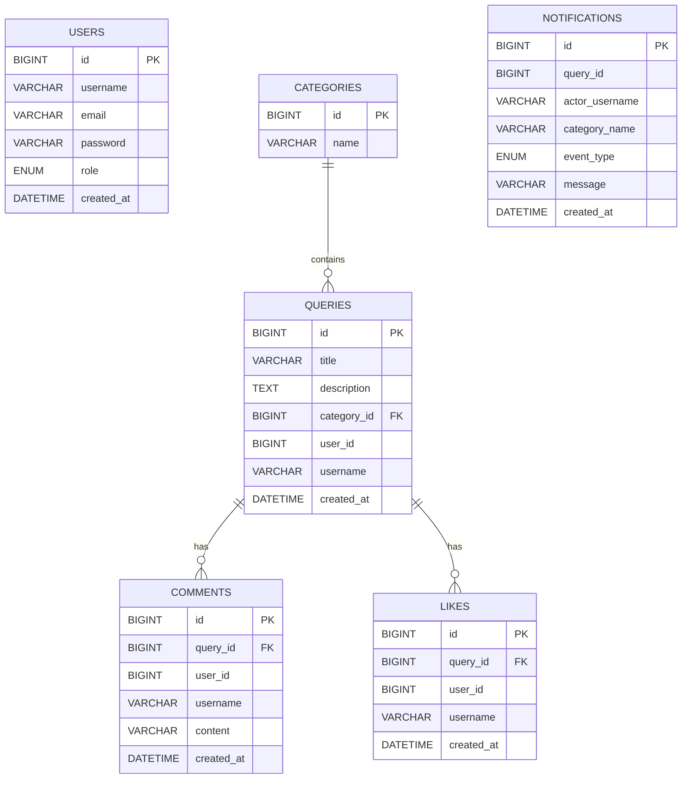
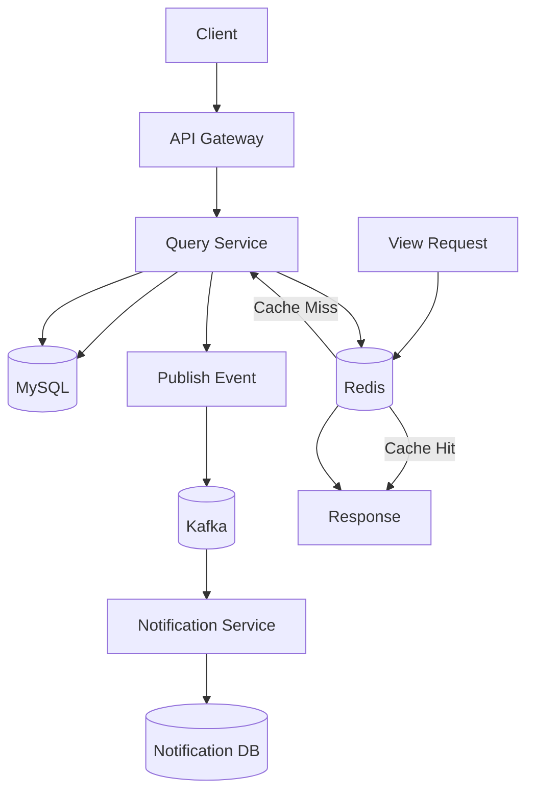
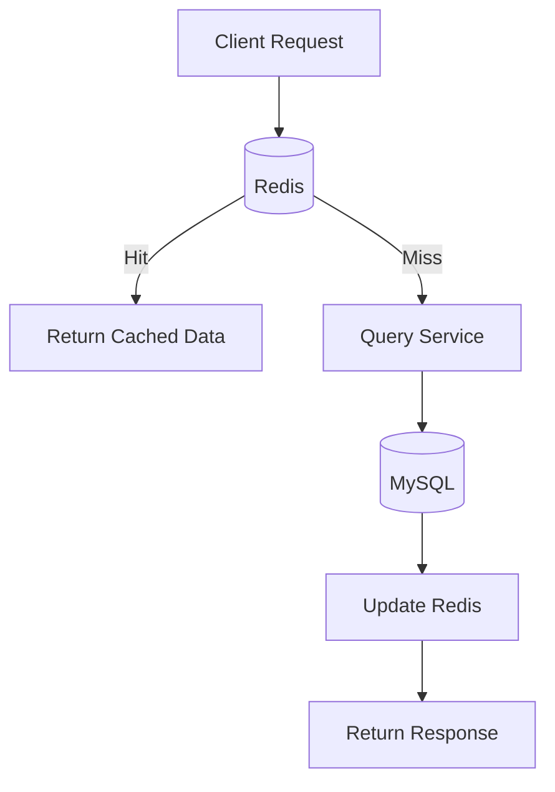
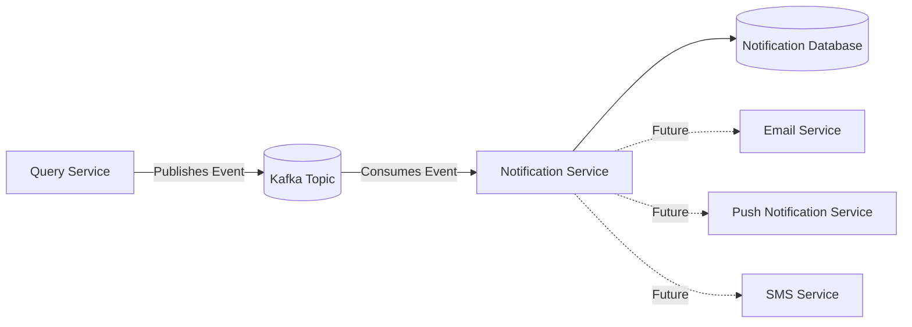

# QueryHub
         

A production-inspired discussion platform built with Spring Boot microservices to demonstrate scalable backend architecture, event-driven communication, distributed caching, and modern service-oriented design.

> Built as a production-oriented backend system following database-per-service architecture, asynchronous messaging, and cache-aside patterns.

## Motivation

QueryHub was built to explore how modern distributed backend systems are designed and deployed. The project focuses on microservice decomposition, asynchronous communication, distributed caching, and scalable service architecture while maintaining clear service boundaries through a database-per-service approach.

## Architecture


This project was designed to explore backend scalability concepts by decomposing the application into independently deployable services.



## Request Flow Sequence


      
## Design Decisions

- Database-per-Service architecture to ensure loose coupling between services.
- API Gateway as the single entry point for routing and authentication.
- Redis Cache-Aside pattern to reduce read latency and database load.
- Apache Kafka for asynchronous notification processing and service decoupling.
- Independent deployment of services using Docker Compose.
- JWT-based authentication for stateless authorization.

## Microservices

| Service | Responsibility |
|---------|----------------|
| Auth Service | User authentication & JWT |
| Query Service | Categories, Queries, Comments, Likes |
| View Service | Read-only APIs with Redis caching |
| Notification Service | Kafka consumer for notifications |
| API Gateway | Single entry point for all APIs |

Benefits include:

- Independent deployment
- Service isolation
- Database-per-service
- Better scalability
- Fault isolation
- Technology flexibility
   
## Features

- User Registration & Login (JWT Authentication)
- Category Management
- Query CRUD Operations
- Comments & Likes
- Read-Optimized View Service
- Redis Read Cache with TTL
- Cache Invalidation on Data Updates
- Kafka-based Asynchronous Notifications
- API Gateway for Unified Routing
- Docker Compose Deployment

## Tech Stack

- Java 17
- Spring Boot 3
- Spring Security (JWT)
- Spring Data JPA
- MySQL
- Redis
- Apache Kafka
- Docker & Docker Compose
- Maven

## Redis Strategy

The View Service follows the Cache-Aside pattern.



Cache invalidation occurs after every successful write operation.

## Running the Project

```bash
git clone https://github.com/singhshashwat2108/Microservice_Platform.git

cd Microservice_Platform

docker compose up --build
```

Services:

- Gateway → http://localhost:8080
- Auth Service → 8081
- Query Service → 8082
- View Service → 8083
- Notification Service → 8084

## Communication

- **Synchronous:** REST (Gateway ↔ Services, View Service → Query Service)
- **Asynchronous:** Apache Kafka (Query Service → Notification Service)
 
## Caching

Redis implements the Cache-Aside pattern:

- Cache lookup on read
- Database fallback on cache miss
- TTL-based expiration
- Cache invalidation after successful write operations
  
## Event Flow



## Event-Driven Notifications

Events published by Query Service:

- `query-created`
- `comment-added`
- `query-liked`

Notification Service consumes these events and persists notifications asynchronously.

## Project Highlights

- Database-per-Service architecture
- API Gateway
- JWT Authentication
- Redis Caching
- Kafka Event Streaming
- Dockerized Deployment
- Read/Write Separation
- Event-Driven Microservices

## Built With

- Spring Boot
- Spring Security
- Spring Data JPA
- MySQL
- Redis
- Apache Kafka
- Docker
- JWT
- Maven
 

## Future Improvements

- Kubernetes deployment
- CI/CD using GitHub Actions
- Prometheus + Grafana monitoring
- Distributed tracing
- Circuit Breaker (Resilience4j)
- Service Discovery (Eureka)
- OpenTelemetry
