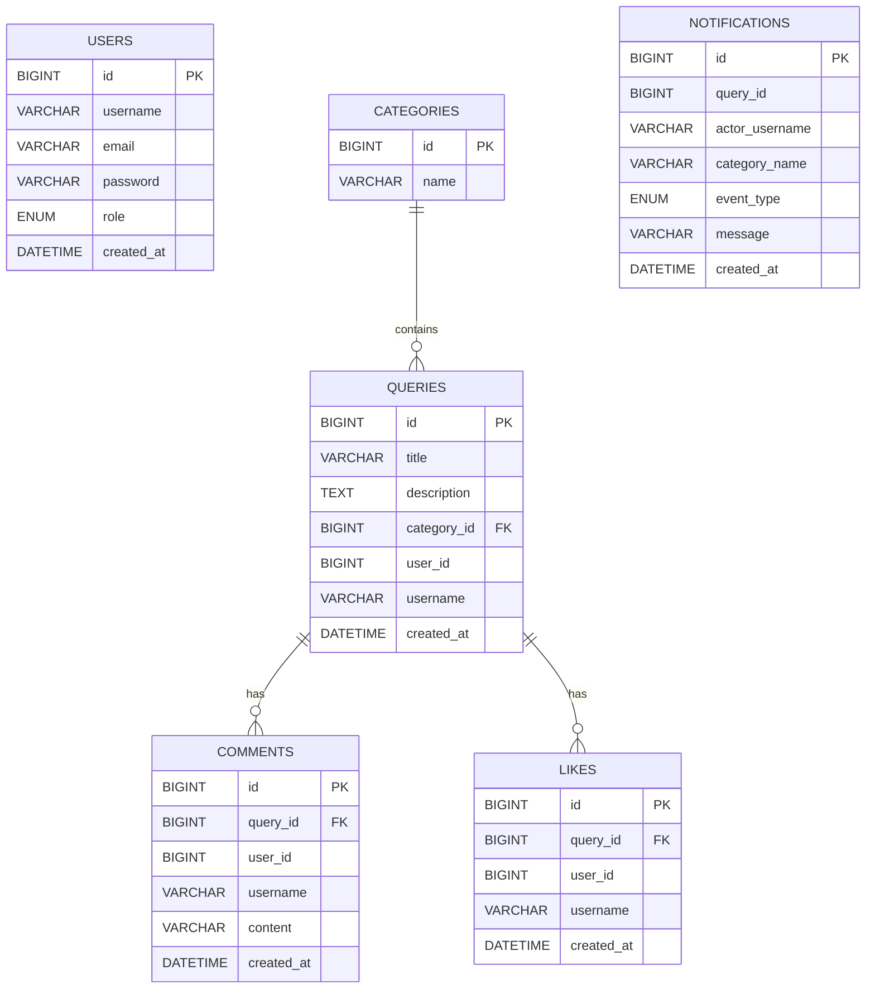

# QueryHub

A scalable discussion platform built using Spring Boot microservices to demonstrate modern backend architecture, event-driven communication, distributed caching, and API gateway design.

> Built as a production-oriented backend system following database-per-service architecture, asynchronous messaging, and cache-aside patterns.

## Architecture

```
                 Client
                    │
             API Gateway (8080)
      ┌─────────────┼─────────────┐
      ▼             ▼             ▼
 Auth Service   Query Service   View Service
      │              │              │
   Auth DB       Query DB       Redis Cache
                     │
                     ▼
                  Apache Kafka
                     │
                     ▼
           Notification Service
                     │
                     ▼
             Notification DB
```
<<<<<<< HEAD

=======
This project was designed to explore backend scalability concepts by decomposing the application into independently deployable services.



Benefits include:

- Independent deployment
- Service isolation
- Database-per-service
- Better scalability
- Fault isolation
- Technology flexibility
   
## Features

- User Registration & Login (JWT Authentication)
- Category Management
- Query CRUD Operations
- Comments & Likes
- Read-Optimized View Service
- Redis Read Cache with TTL
- Cache Invalidation on Data Updates
- Kafka-based Asynchronous Notifications
- API Gateway for Unified Routing
- Docker Compose Deployment

## Tech Stack

- Java 17
- Spring Boot 3
- Spring Security (JWT)
- Spring Data JPA
- MySQL
- Redis
- Apache Kafka
- Docker & Docker Compose
- Maven

## Microservices

| Service | Responsibility |
|---------|----------------|
| Auth Service | User authentication & JWT |
| Query Service | Categories, Queries, Comments, Likes |
| View Service | Read-only APIs with Redis caching |
| Notification Service | Kafka consumer for notifications |
| API Gateway | Single entry point for all APIs |

<<<<<<< HEAD
=======
## Redis Strategy

The View Service follows the Cache-Aside pattern.

Read Request

↓

Redis

↓

Cache Hit → Return

↓

Cache Miss

↓

Query Service

↓

Database

↓

Redis Update

↓

Client

Cache invalidation occurs after every successful write operation.

>>>>>>> e33e957780d05b1c4fdfd6672ef336318f3d70ed
## Running the Project

```bash
git clone <repository-url>

cd QueryHub_Microservices

docker compose up --build
```

Services:

- Gateway → http://localhost:8080
- Auth Service → 8081
- Query Service → 8082
- View Service → 8083
- Notification Service → 8084

## Communication

- **Synchronous:** REST (Gateway ↔ Services, View Service → Query Service)
- **Asynchronous:** Apache Kafka (Query Service → Notification Service)

<<<<<<< HEAD
## Caching

Redis implements the Cache-Aside pattern:

- Cache lookup on read
- Database fallback on cache miss
- TTL-based expiration
- Cache invalidation after successful write operations
=======
## Event Flow

Query Created

↓

Query Service

↓

Kafka Topic

↓

Notification Service

↓

Notification Database

↓

Future:

Email

Push Notification

SMS
>>>>>>> e33e957780d05b1c4fdfd6672ef336318f3d70ed

## Event-Driven Notifications

Events published by Query Service:

- `query-created`
- `comment-added`
- `query-liked`

Notification Service consumes these events and persists notifications asynchronously.

## Project Highlights

- Database-per-Service architecture
- API Gateway
- JWT Authentication
- Redis Caching
- Kafka Event Streaming
- Dockerized Deployment
- Read/Write Separation
- Event-Driven Microservices
<<<<<<< HEAD
=======

## Future Improvements

- Kubernetes deployment
- CI/CD using GitHub Actions
- Prometheus + Grafana monitoring
- Distributed tracing
- Circuit Breaker (Resilience4j)
- Service Discovery (Eureka)
- OpenTelemetry
>>>>>>> e33e957780d05b1c4fdfd6672ef336318f3d70ed
